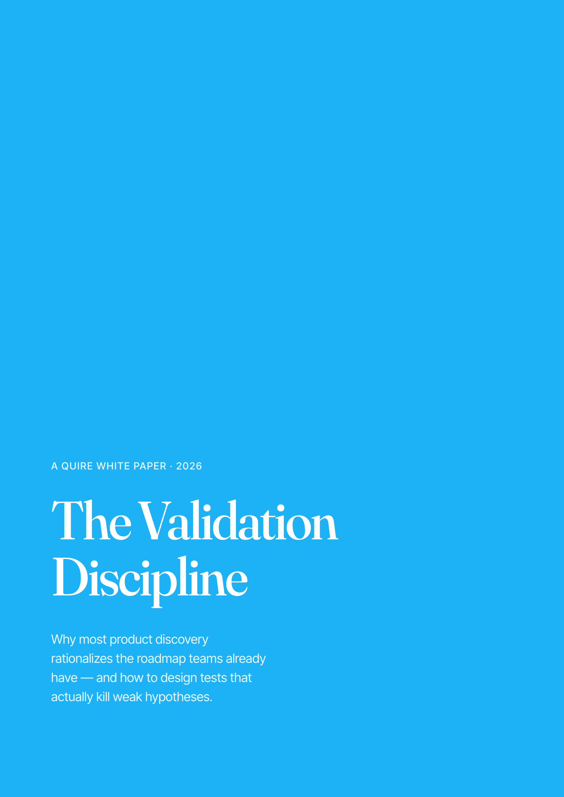
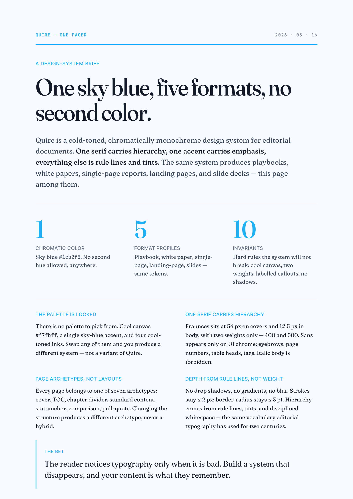
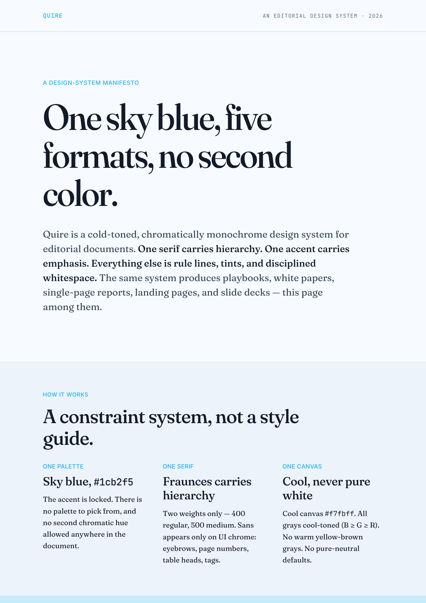
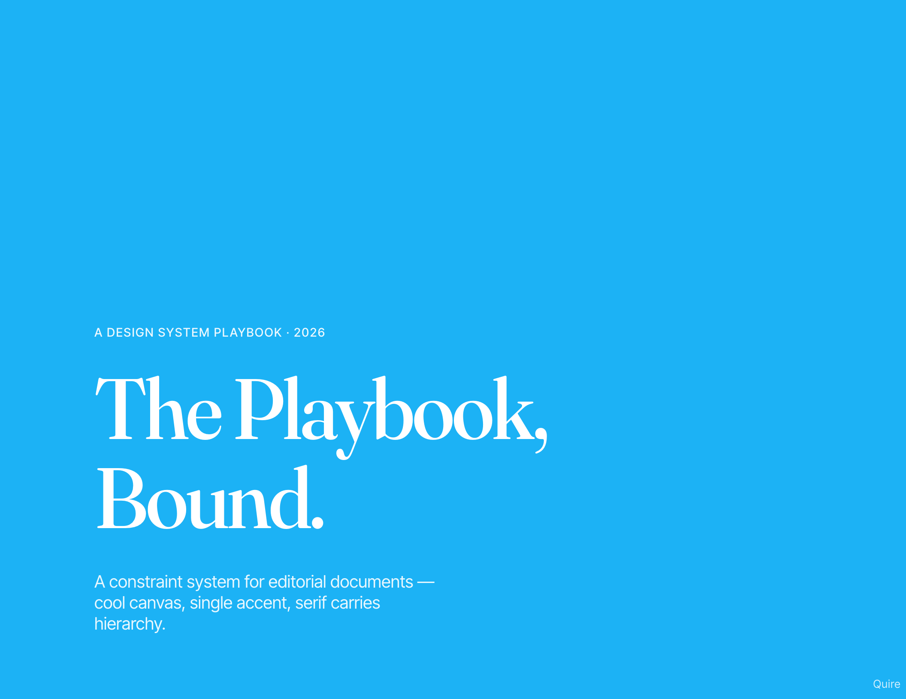
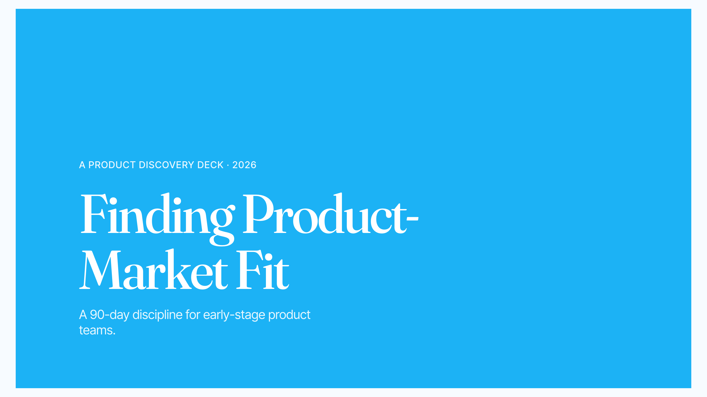

<div align="center">
  <h1>Quire</h1>
  <p><b>One sky-blue, five formats, no second color.</b></p>
  <p>A cold-toned, chromatically monochrome design system for editorial documents.</p>
</div>

## What it is

Quire is a constraint system for editorial documents — playbooks, white papers, single-page reports — that share one design language and produce typeset PDFs. Cool canvas, single sky-blue accent, serif carries hierarchy, no second color anywhere.

## See it · five outputs, one system

<table>
  <tr>
    <td align="center" width="33%">
      <a href="https://founddream.github.io/Quire/assets/output/quire-white-paper.html"></a><br>
      <sub><b>White paper</b> · A4 portrait · 8–30 pp<br><a href="https://founddream.github.io/Quire/assets/output/quire-white-paper.html">HTML</a> · <a href="https://founddream.github.io/Quire/assets/output/quire-white-paper.pdf">PDF</a></sub>
    </td>
    <td align="center" width="33%">
      <a href="https://founddream.github.io/Quire/assets/output/quire-single-page.html"></a><br>
      <sub><b>Single-page report</b> · A4 portrait, fixed · 1 pp<br><a href="https://founddream.github.io/Quire/assets/output/quire-single-page.html">HTML</a> · <a href="https://founddream.github.io/Quire/assets/output/quire-single-page.pdf">PDF</a></sub>
    </td>
    <td align="center" width="33%">
      <a href="https://founddream.github.io/Quire/assets/output/quire-landing-page.html"></a><br>
      <sub><b>Landing page</b> · A4 width, continuous<br><a href="https://founddream.github.io/Quire/assets/output/quire-landing-page.html">HTML</a> · <a href="https://founddream.github.io/Quire/assets/output/quire-landing-page.pdf">PDF</a></sub>
    </td>
  </tr>
</table>

<table>
  <tr>
    <td align="center" width="62%">
      <a href="https://founddream.github.io/Quire/assets/output/quire-playbook.html"></a><br>
      <sub><b>Playbook</b> · 11×8.5in landscape · 10–80 pp<br><a href="https://founddream.github.io/Quire/assets/output/quire-playbook.html">HTML</a> · <a href="https://founddream.github.io/Quire/assets/output/quire-playbook.pdf">PDF</a></sub>
    </td>
    <td align="center" width="38%">
      <a href="https://founddream.github.io/Quire/assets/output/quire-slides.html"></a><br>
      <sub><b>Slides</b> · 16:9 HTML deck · 5–60 slides<br><a href="https://founddream.github.io/Quire/assets/output/quire-slides.html">HTML</a> · <a href="https://founddream.github.io/Quire/assets/output/quire-slides.pdf">PDF</a></sub>
    </td>
  </tr>
</table>

Same palette, same typography, same component library — five document shapes. Click any thumbnail to open the live HTML; the PDF link gives the typeset version.

## Install

### As an agent skill (recommended)

One command, works with Claude Code, Cursor, Codex, Goose, and every other agent the [skills](https://github.com/vercel-labs/skills) CLI supports:

```bash
npx skills add FoundDream/Quire
```

Claude Code

```bash
npx skills add FoundDream/Quire -a claude-code -g -y
```

Codex

```bash
npx skills add FoundDream/Quire -a codex -g -y
```

Generic agents

```bash
npx skills add FoundDream/Quire -a '*' -g -y
```

### Manual install (no Node required)

```bash
git clone https://github.com/FoundDream/Quire.git ~/.claude/skills/quire
```

For project-scoped install, clone into `<project>/.claude/skills/quire` instead.

## Palette

```
canvas       #f7fbff     cool canvas, never pure white
ink          #131b2a     primary text, cool-toned near-black
accent       #1cb2f5     sky blue — the only chromatic color
accent-tint  #c8ebfa     chapter divider fill, tag background
accent-deep  #0d8ace     body links, AA-passing accent text
```

The accent is locked. There is no palette to pick from, and no second chromatic hue allowed.

## Structure

- **`SKILL.md`** — agent entry point: triggers, decision steps, working modes
- **`CHEATSHEET.md`** — one-page quick reference
- **`references/`** — full spec (design / writing / anti-patterns / production)
- **`assets/styles/`** — shared system CSS (typography source of truth)
- **`assets/templates/`** — fillable HTML templates
- **`assets/output/`** — rendered demos (the self-introducing playbook lives here)
- **`scripts/`** — build (`build.sh`), linter (`check.py`), README/index thumbnails (`screenshots.sh`)

## Triggers

- "做一份 playbook / 白皮书 / 报告"
- "build me a playbook / typeset a white paper / single-page report"
- "turn this content into an editorial PDF"

## Inspired by

The repository structure was originally learned from [tw93/kami](https://github.com/tw93/kami). ♥️

## License

MIT.
